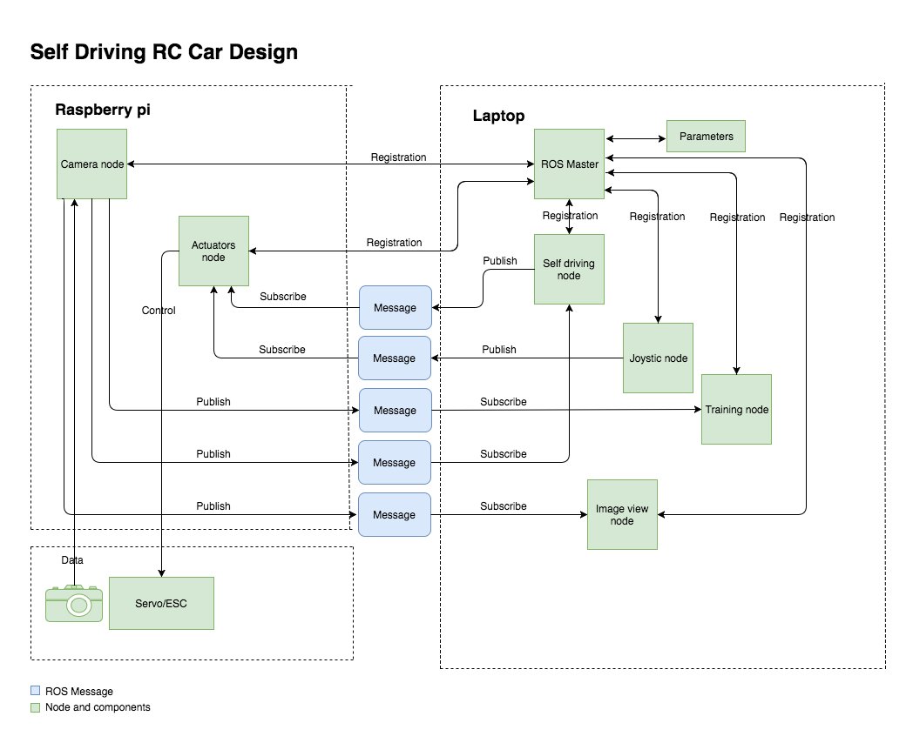

# Robocar

This contains codebase of the earlier efforts using raspberry pi to create the autonomous capability. This runs on a framework called Robotic Operating System(ROS). The codebase contains ROS nodes that control the individual componets of the project and deep learning code for training the model. 

Architecture:

This version is trying to make use of [NVIDIA's End to End Deep Learning](https://devblogs.nvidia.com/deep-learning-self-driving-cars/) concept.

Please read the [medium post](https://medium.com/intro-to-artificial-intelligence/self-driving-rc-car-using-robotic-operating-system-ros-c63a6d102c08) to understand the structure of the project further.
